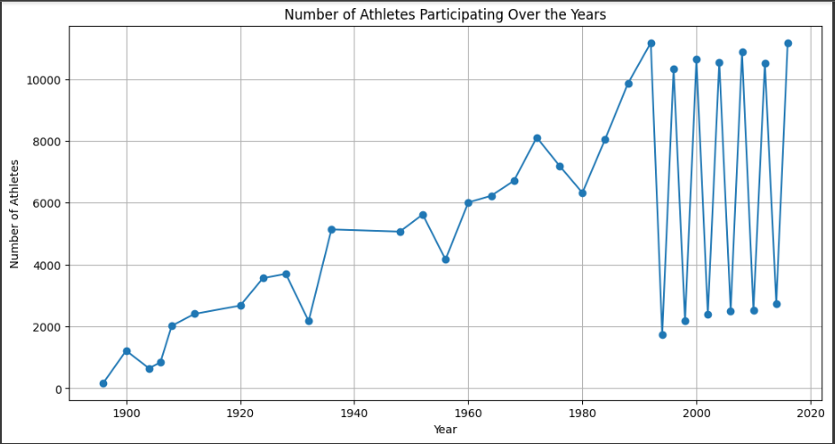
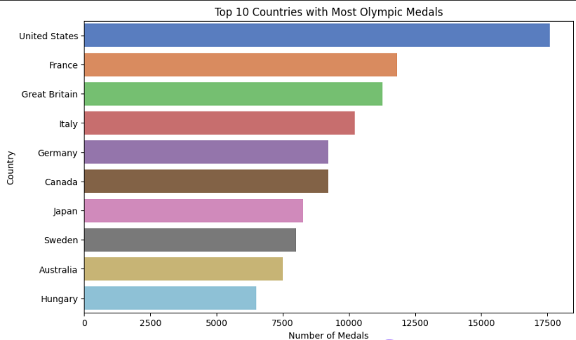
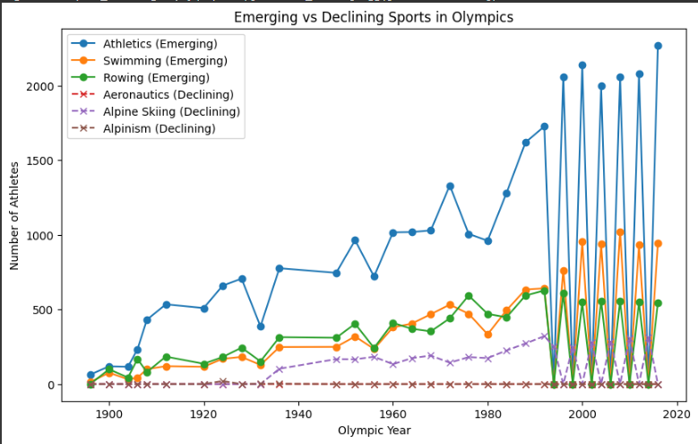

# 🏅 Olympics Data Analysis (EDA)

This project analyzes **120 years of Olympic history (Athletes and Results)** using **Python (Pandas, NumPy, Matplotlib, Seaborn)**.  
The notebook covers **data cleaning, exploratory data analysis, and visualizations** to uncover insights about athlete participation, medal counts, and trends over time.

---

## 📂 Project Structure

```
Olympics-Analysis/
│
├── Olympics-EDA.ipynb    # Main analysis notebook
├── requirements.txt       # Dependencies
├── README.md              # Project documentation
├── athlete_events.csv     # Olympic history dataset 
└── visualizations/        # Saved plots from the analysis
```
## 📊 Dataset

- **Source:** [120 years of Olympic history: athletes and results](https://www.kaggle.com/datasets/heesoo37/120-years-of-olympic-history-athletes-and-results)  
- **Size:** ~60 MB, 271,116 rows × 15 columns  
- **Columns:** `ID, Name, Sex, Age, Height, Weight, Team, NOC, Games, Year, Season, City, Sport, Event, Medal`


---

## 🛠️ Installation

Clone this repository and install dependencies:

```bash
git clone https://github.com/your-username/Olympics-Analysis.git
cd Olympics-Analysis
pip install -r requirements.txt
```

---

## 📊 Analysis Covered

1. **Data Cleaning**
   - Handle missing values & duplicates  
   - Ensure correct data types (e.g., Age as numeric, Medal as category)

2. **Exploratory Analysis**
   - Number of athletes participated over the years  
   - Top 10 countries with the most medals  
   - Sports with the most events and medals  

3. **Statistical Insights (NumPy)**
   - Average & range of athlete ages  
   - Unique sports, events, and countries  

4. **Pandas Analysis**
   - Medal counts by country, sport, and year  
   - Athlete with the most medals  
   - Gender participation trends over time  

---

## 📈 Visualizations

The notebook generates several plots to better understand Olympic history:

- Athletes participation over year


- Top 10 countries by medal count
   

- Emerging vs declining sports across Olympics
  


---


---

## 🤝 Contributing

Contributions are welcome!  
If you’d like to improve the analysis, add new visualizations, or optimize the notebook, feel free to fork the repo and open a pull request.

---

## 📜 License

This project is licensed under the **MIT License**.  
Dataset © Kaggle.
